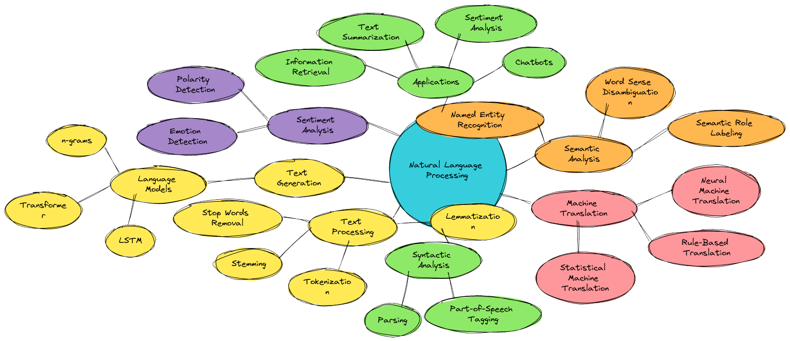
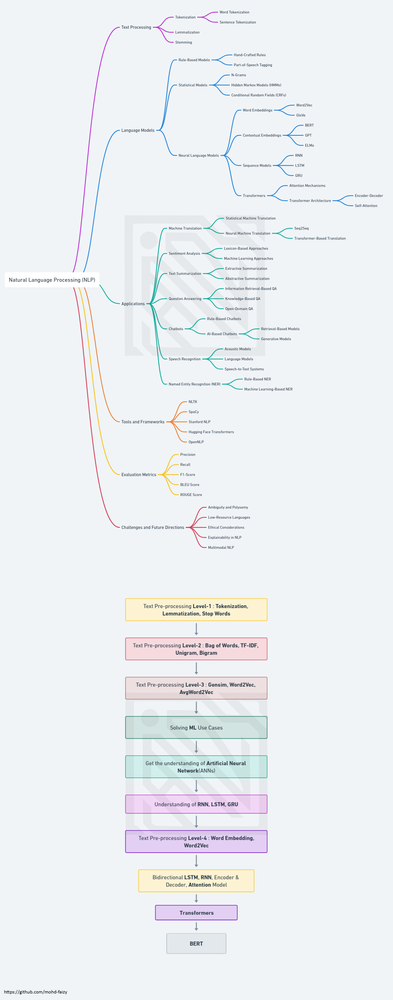
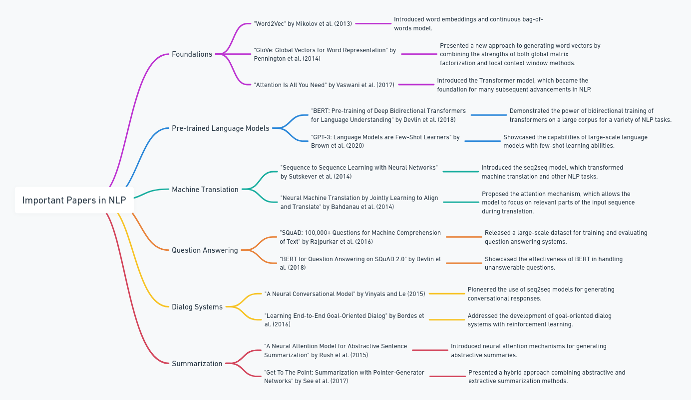

  

[-00C853?style=for-the-badge&logo=checkmarx&logoColor=white)](https://github.com/mohd-faizy/Natural_Language_Processing_in_Python)

---

## Natural Language Processing in Python

Welcome to the Natural Language Processing repository!. This repository serves as a comprehensive resource for mastering NLP techniques in Python. 

## Steps in Natural Language Processing

  

## 📚 Comprehensive Catalog of NLP Topics and Associated Code

- ✨[**NLP Basics**](#⭐nltk-for-natural-language-processing-nlp)
- 🌟[**Sentiment Analysis**](#📌-5-question-answering--reasoning)
- 🤖[**Building Chatbots**](#📌-6-dialog-systems--agents)
- 🚀[**spaCy**](#⭐spacy-for-natural-language-processing-nlp)
- 🗣️[**Spoken Language Processing**](#📌-4-machine-translation)
- 📊[**Feature Engineering for NLP**](#⭐scikit-learn-for-natural-language-processing-nlp)
- 📚[**Additional NLP Topics**](#📌-additional-reading)
- 🔥[**BERT (Bidirectional Encoder Representations from Transformers)**](#encoder-based-models)
- 🌌[**Large Language Models (LLMs)**](#decoder-based-models-llms)
- 👁️[**Multimodal NLP**](#📌-9-multimodal-nlp)
- 🔄[**RAG & Retrieval Systems**](#📌-8-retrieval-augmented-generation-rag)
- 🧠[**Post-Transformer Architectures**](#📌-10-post-transformer-directions)

## 🛣️ Roadmap NLP

  

## 📚Frequently Used NLP Libraries and Functions

| Library/Function                    |                                                                                                    Description                                                                                                                                     |
| ------------------------------------| ---------------------------------------------------------------------------------------------------------------------------------------------------------------------------------------------------------------------------------------------------|
| [**`NLTK`**](https://www.nltk.org/) | NLTK (Natural Language Toolkit) is a comprehensive library for natural language processing tasks. It offers a wide range of tools and resources for text analysis, including tokenization, part-of-speech tagging, and sentiment analysis.         |
| [**`Scikit-learn`**](https://scikit-learn.org/stable/) | Scikit-learn, a versatile machine learning library, empowers you to build sophisticated models for various NLP applications. Its extensive set of algorithms and tools enables intelligent data-driven decision-making.         |
| [**`spaCy`**](https://spacy.io/) | spaCy is a robust NLP library suitable for both small-scale projects and enterprise-level applications. It excels in tasks like text processing, named entity recognition, and dependency parsing, offering high-performance processing.              |
| [**`Speech Recognition`**](https://pypi.org/project/SpeechRecognition/) | Speech Recognition opens the door to voice data analysis, allowing you to explore and extract valuable insights from spoken language, facilitating voice-related NLP projects.                                 |
| [**`Gensim`**](https://radimrehurek.com/gensim/) | Gensim is a specialized library for topic modeling and document similarity analysis. Widely used for text summarization and document clustering, it helps you extract meaningful information from textual data.                       |
| [**`TextBlob`**](https://textblob.readthedocs.io/) | TextBlob is a user-friendly NLP library offering an intuitive interface for common NLP tasks such as sentiment analysis, part-of-speech tagging, and translation, simplifying the NLP process.                                      |
| [**`Transformers`**](https://huggingface.co/transformers/) | The Transformers library from Hugging Face is the preferred choice for working with pre-trained language models like BERT, GPT-2, and T5. It empowers you to leverage state-of-the-art NLP capabilities with ease.          |
| [**`Word2Vec`**](https://radimrehurek.com/gensim/models/word2vec.html) | Word2Vec is an algorithm dedicated to learning word embeddings from extensive text corpora. Leveraged by Gensim, it facilitates advanced text analysis and semantic understanding.                              |
| [**`Stanford NLP`**](https://stanfordnlp.github.io/CoreNLP/) | Stanford NLP provides a suite of advanced NLP tools, including tokenization, part-of-speech tagging, named entity recognition, and dependency parsing, enabling precise and comprehensive text analysis.                  |
| [**`Pattern`**](https://www.clips.uantwerpen.be/pages/pattern-en) | Pattern is a versatile library for web mining, natural language processing, and machine learning. It equips you with a wide range of NLP tools and features for in-depth text analysis.                              |
| [**`PyNLPIR`**](https://pynlpir.readthedocs.io/en/latest/) | PyNLPIR serves as a Python wrapper for the Chinese text segmentation tool NLPIR, an essential component for Chinese NLP tasks, ensuring efficient and accurate text processing.                                             |
| [**`VADER Sentiment Analysis`**](https://github.com/cjhutto/vaderSentiment) | VADER (Valence Aware Dictionary and sEntiment Reasoner) is a pre-trained sentiment analysis tool tailored for social media text. It aids in assessing sentiment polarity with precision in online content. |
---

---

## ⭐NLTK for Natural Language Processing (NLP)

| **Category**                  | **Component**                   | **Description**                                                                                         |
|-------------------------------|----------------------------------|---------------------------------------------------------------------------------------------------------|
| **Text Tokenization and Preprocessing** | Tokenization                   | Splits text into words or sentences.                                                                    |
|                               | Stopwords Removal                | Removes common words (e.g., "the," "and") that may not be informative for NLP tasks.                    |
|                               | Stemming                         | Reduces words to their root form (e.g., "running" becomes "run") to normalize text.                     |
|                               | Lemmatization                    | Similar to stemming but reduces words to their base or dictionary form (e.g., "better" becomes "good"). |
| **Part-of-Speech Tagging**    | POS Tagging                      | Assigns grammatical tags to words in a sentence (e.g., noun, verb, adjective).                          |
|                               | Named Entity Recognition (NER)   | Identifies and classifies named entities such as names of people, places, and organizations.            |
| **Text Corpora and Resources**| Corpus Data                      | Provides access to various text corpora and datasets for NLP research and practice.                     |
|                               | Lexical Resources                | Includes resources like WordNet, a lexical database, for synonym and semantic analysis.                 |
| **Parsing and Syntax Analysis** | Parsing                         | Parses sentences to determine their grammatical structure.                                              |
|                               | Dependency Parsing               | Analyzes the grammatical relationships between words in a sentence.                                     |
| **Machine Learning and Classification** | Naive Bayes                  | Implements Naive Bayes classifiers for text classification.                                             |
|                               | Decision Trees                   | Uses decision trees for text classification and other NLP tasks.                                        |
| **Concordance and Frequency Analysis** | Concordance                | Provides concordance views of words within a corpus for context analysis.                               |
|                               | Frequency Analysis               | Analyzes word frequency and distribution in text data.                                                  |
| **Sentiment Analysis**        | Sentiment Analysis               | Performs sentiment analysis to determine the sentiment (positive, negative, neutral) of text.           |
| **Word Similarity and Semantics** | Word Similarity               | Measures the similarity between words or phrases based on their meaning.                                |
|                               | Semantic Relations               | Analyzes semantic relations between words and concepts in text data.                                    |
| **Language Processing Pipelines** | NLP Pipelines                | Constructs and customizes NLP processing pipelines for various tasks.                                   |
| **Language Models**           | Language Models                  | Provides access to pre-trained language models for various NLP tasks.                                   |
| **Categorization and Topic Modeling** | Text Categorization        | Categorizes documents into predefined topics or classes.                                                |
|                               | Topic Modeling                   | Identifies topics within a corpus of text documents using techniques like LDA (Latent Dirichlet Allocation). |
| **Language Translation**      | Translation                      | Supports machine translation of text between different languages.                                       |

---

## ⭐Scikit-Learn for Natural Language Processing (NLP)

| **Category**                   | **Component**                   | **Description**                                                                                         |
|--------------------------------|----------------------------------|---------------------------------------------------------------------------------------------------------|
| **Feature Extraction and Preprocessing** | CountVectorizer     | Converts a collection of text documents into a matrix of token counts.                                  |
|                                |                                | Each row represents a document, and each column represents a unique word (token).                        |
|                                |                                | Useful for creating a Bag of Words (BoW) representation of text data.                                     |
|                                | TfidfVectorizer     | Converts text documents into a matrix of TF-IDF (Term Frequency-Inverse Document Frequency) features.   |
|                                |                                | TF-IDF considers both the frequency of a word in a document and its rarity across all documents.         |
|                                |                                | Helps in weighting words based on their importance in a document corpus.                                 |
|                                | HashingVectorizer   | Hashes words into a fixed-dimensional space.                                                             |
|                                |                                | Useful for dealing with large datasets where traditional vectorization methods may be memory-intensive.   |
|                                | LabelEncoder        | Encodes class labels as integer values.                                                                 |
|                                |                                | Useful for converting text-based class labels into a format suitable for machine learning models.        |
| **Text Classification**        | LogisticRegression  | A simple linear model used for binary and multiclass text classification.                                |
|                                | MultinomialNB       | Naive Bayes classifier specifically designed for text data.                                             |
|                                |                                | Assumes that features (words) are conditionally independent.                                             |
|                                | SVM (SVC)           | Support Vector Machine classifier, which can be used for text classification.                           |
|                                |                                | Effective in high-dimensional spaces, which is common in text data.                                       |
|                                | RandomForestClassifier | Ensemble method for text classification that combines multiple decision trees.                          |
|                                |                                | Robust and capable of handling high-dimensional feature spaces.                                           |
| **Model Evaluation**           | cross_val_score     | Performs k-fold cross-validation to evaluate model performance.                                         |
|                                |                                | Helps estimate how well a model will generalize to unseen data.                                          |
|                                | GridSearchCV        | Performs a grid search over hyperparameters to find the best model configuration.                        |
|                                |                                | Useful for hyperparameter tuning.                                                                         |
|                                | metrics             | Module containing various metrics for evaluating classification models.                                  |
|                                |                                | Includes accuracy, precision, recall, F1-score, and more.                                                 |
| **Dimensionality Reduction**   | TruncatedSVD        | Dimensionality reduction technique using Singular Value Decomposition (SVD).                             |
|                                |                                | Useful for reducing the dimensionality of high-dimensional text data while preserving important information. |
| **Feature Selection**          | SelectKBest         | Selects the top k features based on statistical tests.                                                   |
|                                |                                | Helps in choosing the most informative features for text classification.                                   |
|                                | SelectFromModel     | Selects features based on the importance assigned to them by a specific model (e.g., decision trees).     |
| **Pipelines**                  | Pipeline            | Allows you to chain together multiple transformers and estimators into a single object.                  |
|                                |                                | Useful for creating a streamlined workflow for text preprocessing and modeling.                            |
|                                | FeatureUnion        | Combines the results of multiple transformer objects into a single feature space.                        |
| **Preprocessing and Transformation** | StandardScaler      | Standardizes features by removing the mean and scaling to unit variance.                                  |
|                                |                                | Useful for ensuring that features have similar scales, which can be important for certain algorithms.     |
|                                | MinMaxScaler        | Scales features to a specified range, typically [0, 1].                                                  |
|                                | LabelBinarizer      | Converts categorical labels into a one-hot encoding format.                                              |
| **Clustering**                 | KMeans              | A popular clustering algorithm that can be applied to group text documents into clusters based on similarity. |
|                                | DBSCAN              | Density-based clustering algorithm that can be used for text data to discover clusters with varying shapes and sizes. |
| **Model Serialization**        | joblib              | A library used to save trained models to disk and load them for future use.                              |

---

## ⭐SpaCy for Natural Language Processing (NLP)

| **Category**                           | **Component**                  | **Description**                                                                                     |
|----------------------------------------|--------------------------------|-----------------------------------------------------------------------------------------------------|
| **Tokenization and Text Preprocessing** | Tokenization                   | Splits text into words, punctuation, and spaces, creating tokens.                                  |
|                                        | Named Entity Recognition (NER) | Identifies and classifies named entities such as names of people, places, and organizations.        |
|                                        | Part-of-Speech Tagging         | Assigns grammatical tags to words in a sentence (e.g., noun, verb, adjective).                      |
|                                        | Lemmatization                  | Reduces words to their base or dictionary form (e.g., "better" becomes "good").                     |
|                                        | Dependency Parsing             | Analyzes grammatical relationships between words in a sentence.                                     |
| **Word Vectors and Embeddings**        | Word Vectors                   | Provides word vectors (word embeddings) for words in various languages.                             |
|                                        | Pre-trained Models             | Offers pre-trained models with word embeddings for common NLP tasks.                                |
|                                        | Similarity Analysis            | Measures word and document similarity based on word vectors.                                        |
| **Text Classification**                | Text Classification            | Supports text classification tasks using machine learning models.                                   |
|                                        | Custom Models                  | Allows training custom text classification models with spaCy.                                       |
| **Rule-Based Matching**                | Rule-Based Matching            | Defines rules to identify and extract information based on patterns in text data.                   |
|                                        | Phrase Matching                | Matches phrases and entities using custom rules.                                                    |
| **Entity Linking and Disambiguation**  | Entity Linking                 | Links named entities to external knowledge bases or databases (e.g., Wikipedia).                    |
|                                        | Disambiguation                 | Resolves entity mentions to the correct entity in a knowledge base.                                 |
| **Text Summarization**                 | Text Summarization             | Generates concise summaries of longer text documents.                                               |
|                                        | Extractive Summarization       | Summarizes text by selecting and extracting important sentences.                                    |
|                                        | Abstractive Summarization      | Summarizes text by generating new sentences that capture the essence of the content.                |
| **Dependency Visualization**           | Dependency Visualization       | Creates visual representations of sentence grammatical structure and dependencies.                  |
| **Language Detection**                 | Language Detection             | Detects the language of text data.                                                                  |
| **Named Entity Recognition (NER) Customization** | NER Training       | Allows training custom named entity recognition models for specific entities or domains.              |
| **Language Support**                   | Multilingual Support           | Provides language models and support for multiple languages.                                        |
|                                        | Language Models                | Includes pre-trained language models for various languages.                                         |

---

## ⭐Gensim for Natural Language Processing (NLP)

| **Category**                         | **Component**             | **Description**                                                                                     |
|--------------------------------------|---------------------------|-----------------------------------------------------------------------------------------------------|
| **Word Embeddings and Word Vector Models** | Word2Vec              | Implements Word2Vec models for learning word embeddings from text data.                             |
|                                      | FastText                 | Provides FastText models for learning word embeddings, including subword information.                |
|                                      | Doc2Vec                  | Learns document-level embeddings, allowing you to represent entire documents as vectors.             |
| **Topic Modeling**                   | Latent Dirichlet Allocation (LDA) | Implements LDA for discovering topics within a collection of documents.                          |
|                                      | Latent Semantic Analysis (LSA) | Performs LSA for extracting topics and concepts from large document corpora.                      |
|                                      | Non-Negative Matrix Factorization (NMF) | Applies NMF for topic modeling and feature extraction from text data.                         |
| **Similarity and Document Comparison** | Cosine Similarity        | Measures cosine similarity between vectors, useful for document and word similarity comparisons.     |
|                                      | Similarity Queries       | Supports similarity queries to find similar documents or words based on embeddings.                  |
| **Text Preprocessing**               | Tokenization             | Provides text tokenization for splitting text into words or sentences.                              |
|                                      | Stopwords Removal        | Removes common words from text data to improve the quality of topic modeling.                        |
|                                      | Phrase Detection         | Detects common phrases or bigrams in text data.                                                     |
| **Model Training and Customization** | Model Training           | Trains custom word embeddings models on your text data for specific applications.                   |
|                                      | Model Serialization      | Allows you to save and load trained models for future use.                                          |
| **Integration with Other Libraries** | Integration              | Can be integrated with other NLP libraries like spaCy and NLTK for enhanced text processing.         |
|                                      | Data Formats             | Supports various data formats for input and output, including compatibility with popular text formats.|

---

## ⭐Transformer-Based Models for Natural Language Processing (NLP)

| **Category**                           | **Component**                  | **Description**                                                                                             |
|----------------------------------------|--------------------------------|-------------------------------------------------------------------------------------------------------------|
| **Hugging Face Transformers**          | Transformers Library           | Provides easy-to-use access to a wide range of pre-trained transformer models for NLP tasks.                |
|                                        | Pre-trained Models             | Includes models like BERT, GPT-2, RoBERTa, T5, and more, each specialized for specific NLP tasks.            |
|                                        | Fine-Tuning                    | Supports fine-tuning pre-trained models on custom NLP datasets for various downstream applications.          |
| **BERT (Bidirectional Encoder Representations from Transformers)** | BERT Models                  | Pre-trained BERT models capture contextual information from both left and right context in text.             |
|                                        | Fine-Tuning                    | Fine-tuning BERT for tasks like text classification, NER, and question-answering is widely adopted.          |
|                                        | Sentence Embeddings            | BERT embeddings can be used for sentence and document-level embeddings.                                       |
| **GPT (Generative Pre-trained Transformer)** | GPT Models                    | GPT-2 and GPT-3 models are popular for generating text and performing various NLP tasks.                      |
|                                        | Text Generation                | GPT models are known for their text generation capabilities, making them useful for creative tasks.          |
| **RoBERTa (A Robustly Optimized BERT Pretraining Approach)** | RoBERTa Models               | RoBERTa builds upon BERT with optimization techniques, achieving better performance on many tasks.            |
|                                        | Fine-Tuning                    | Fine-tuning RoBERTa for text classification and other tasks is common for improved accuracy.                 |
| **T5 (Text-to-Text Transfer Transformer)** | T5 Models                     | T5 models are designed for text-to-text tasks, allowing you to frame various NLP tasks in a unified manner.   |
|                                        | Task Agnostic                  | T5 can handle a wide range of NLP tasks, from translation to summarization and question-answering.           |
| **XLNet (eXtreme MultiLabelNet)**      | XLNet Models                   | XLNet improves upon BERT by considering all permutations of input tokens, enhancing context modeling.         |
|                                        | Pre-training                   | XLNet is pre-trained on vast text data and can be fine-tuned for various NLP applications.                   |
| **DistilBERT**                         | DistilBERT Models              | DistilBERT is a distilled version of BERT, offering a smaller and faster alternative for NLP tasks.           |
|                                        | Efficiency                     | DistilBERT provides similar performance to BERT with reduced computational requirements.                     |
| **Transformers for Other Languages**   | Multilingual Models            | Many transformer models are available for languages other than English, supporting global NLP tasks.          |
|                                        | Translation                    | Transformers can be used for machine translation between multiple languages.                                 |

---

## 🧠 Important Papers in NLP (Updated – 2026)

  

> A comprehensive collection of landmark papers that shaped Natural Language Processing, organized by topic and updated for 2026.

---

### 📌 1. Foundations

#### Word Embeddings

| Paper | Authors | Year | Description | Link |
|-------|---------|------|-------------|------|
| **Word2Vec** | Mikolov et al. | 2013 | Introduced CBOW and Skip-Gram architectures for learning distributed representations | [arXiv](https://arxiv.org/abs/1301.3781) |
| **GloVe** | Pennington et al. | 2014 | Combined matrix factorization and context-based methods using global co-occurrence statistics | [Paper](https://nlp.stanford.edu/pubs/glove.pdf) |
| **FastText** | Bojanowski et al. | 2017 | Used subword information for handling rare and out-of-vocabulary (OOV) words | [arXiv](https://arxiv.org/abs/1607.04606) |

#### Core Architectures

| Paper | Authors | Year | Description | Link |
|-------|---------|------|-------------|------|
| **Attention Is All You Need** | Vaswani et al. | 2017 | Introduced the Transformer architecture, revolutionizing NLP | [arXiv](https://arxiv.org/abs/1706.03762) |
| **Universal Transformers** | Dehghani et al. | 2018 | Added recurrence and adaptive computation steps to Transformers | [arXiv](https://arxiv.org/abs/1807.03819) |
| **Mixture of Experts (MoE)** | Shazeer et al. | 2017 | Used sparse routing to scale model capacity efficiently | [arXiv](https://arxiv.org/abs/1701.06538) |
| **Sparse Transformers** | Child et al. | 2019 | Improved computational efficiency of attention for long sequences | [arXiv](https://arxiv.org/abs/1904.10509) |

---

### 📌 2. Pre-trained Language Models

#### Encoder-based Models

| Paper | Authors | Year | Description | Link |
|-------|---------|------|-------------|------|
| **ELMo** | Peters et al. | 2018 | Introduced contextualized embeddings using bidirectional LSTMs | [arXiv](https://arxiv.org/abs/1802.05365) |
| **BERT** | Devlin et al. | 2018 | Pre-trained bidirectional Transformer on masked language modeling | [arXiv](https://arxiv.org/abs/1810.04805) |
| **RoBERTa** | Liu et al. | 2019 | Optimized BERT's training with longer training and larger batches | [arXiv](https://arxiv.org/abs/1907.11692) |
| **DeBERTa** | He et al. | 2020 | Introduced disentangled attention and enhanced pre-training | [arXiv](https://arxiv.org/abs/2006.03654) |
| **ALBERT** | Lan et al. | 2019 | A Lite BERT with parameter sharing for efficient pre-training | [arXiv](https://arxiv.org/abs/1909.11942) |
| **ELECTRA** | Clark et al. | 2020 | Efficient pre-training using replaced token detection | [arXiv](https://arxiv.org/abs/2003.10555) |

#### Decoder-based Models (LLMs)

| Paper | Authors | Year | Description | Link |
|-------|---------|------|-------------|------|
| **GPT-2** | Radford et al. | 2019 | Demonstrated large-scale generative pretraining | [Blog](https://openai.com/research/better-language-models) |
| **GPT-3** | Brown et al. | 2020 | Showed few-shot learning capabilities with 175B parameters | [arXiv](https://arxiv.org/abs/2005.14165) |
| **GPT-4** | OpenAI | 2023 | Advanced multimodal reasoning and safety alignment | [arXiv](https://arxiv.org/abs/2303.08774) |
| **PaLM** | Chowdhery et al. | 2022 | Scaled Transformer training with pathways architecture | [arXiv](https://arxiv.org/abs/2204.02311) |
| **PaLM 2** | Anil et al. | 2023 | Enhanced multilingual and reasoning capabilities | [arXiv](https://arxiv.org/abs/2305.10403) |
| **LLaMA** | Touvron et al. | 2023 | Open-weight foundation model for research | [arXiv](https://arxiv.org/abs/2302.13971) |
| **LLaMA 2** | Touvron et al. | 2023 | Open-weight model with RLHF fine-tuning | [arXiv](https://arxiv.org/abs/2307.09288) |
| **LLaMA 3** | Meta | 2024 | Improved open-weight foundation models | [arXiv](https://arxiv.org/abs/2407.21783) |
| **Gemini** | Google DeepMind | 2024 | Unified multimodal reasoning and reinforcement learning | [arXiv](https://arxiv.org/abs/2312.11805) |
| **Claude 3** | Anthropic | 2024 | Advanced reasoning with constitutional AI principles | [Technical Report](https://www.anthropic.com/news/claude-3-family) |
| **Qwen 2.5** | Alibaba | 2024 | Multilingual open-weight models with strong performance | [arXiv](https://arxiv.org/abs/2412.15115) |

#### Encoder–Decoder Models

| Paper | Authors | Year | Description | Link |
|-------|---------|------|-------------|------|
| **T5** | Raffel et al. | 2019 | Unified NLP tasks under a text-to-text format | [arXiv](https://arxiv.org/abs/1910.10683) |
| **FLAN-T5** | Wei et al. | 2022 | Fine-tuned T5 on instruction datasets | [arXiv](https://arxiv.org/abs/2210.11416) |
| **UL2** | Tay et al. | 2022 | Flexible objective mixing denoising and span corruption | [arXiv](https://arxiv.org/abs/2205.05131) |
| **Mixtral** | Mistral AI | 2024 | Sparse Mixture-of-Experts seq2seq model enabling scalable efficiency | [arXiv](https://arxiv.org/abs/2401.04088) |

---

### 📌 3. Instruction Tuning & Alignment

| Paper | Authors | Year | Description | Link |
|-------|---------|------|-------------|------|
| **InstructGPT** | Ouyang et al. | 2022 | Introduced RLHF for aligning models with human preferences | [arXiv](https://arxiv.org/abs/2203.02155) |
| **Self-Instruct** | Wang et al. | 2023 | Used self-generated instructions for scalable fine-tuning | [arXiv](https://arxiv.org/abs/2212.10560) |
| **Constitutional AI** | Anthropic | 2022 | Alignment through a principles-based self-critique loop | [arXiv](https://arxiv.org/abs/2212.08073) |
| **DPO** | Rafailov et al. | 2023 | Direct Preference Optimization - simplified preference alignment without RLHF | [arXiv](https://arxiv.org/abs/2305.18290) |
| **RLAIF** | Lee et al. | 2024 | Reinforcement Learning from AI Feedback | [arXiv](https://arxiv.org/abs/2309.00267) |
| **ORPO** | Hong et al. | 2024 | Odds Ratio Preference Optimization | [arXiv](https://arxiv.org/abs/2403.07691) |
| **Reinforced Self-Training** | Singh et al. | 2025 | Self-improvement through iterative refinement | [arXiv](https://arxiv.org/abs/2308.08998) |

---

### 📌 4. Machine Translation

| Paper | Authors | Year | Description | Link |
|-------|---------|------|-------------|------|
| **Seq2Seq** | Sutskever et al. | 2014 | Foundation of neural translation models | [arXiv](https://arxiv.org/abs/1409.3215) |
| **Attention-based NMT** | Bahdanau et al. | 2014 | Introduced attention for sequence alignment | [arXiv](https://arxiv.org/abs/1409.0473) |
| **Transformer for NMT** | Vaswani et al. | 2017 | Replaced RNNs, improving accuracy and speed | [arXiv](https://arxiv.org/abs/1706.03762) |
| **Multilingual NMT** | Johnson et al. | 2017 | Enabled zero-shot translation across languages | [arXiv](https://arxiv.org/abs/1611.04558) |
| **mBART** | Liu et al. | 2020 | Multilingual denoising pre-training | [arXiv](https://arxiv.org/abs/2001.08210) |
| **NLLB** | Costa-jussà et al. | 2022 | No Language Left Behind - 200 language translation | [arXiv](https://arxiv.org/abs/2207.04672) |

---

### 📌 5. Question Answering & Reasoning

#### Datasets & Benchmarks

| Dataset | Authors | Year | Description | Link |
|---------|---------|------|-------------|------|
| **SQuAD 1.1 / 2.0** | Rajpurkar et al. | 2016/2018 | Benchmark for extractive QA | [Paper](https://arxiv.org/abs/1606.05250) |
| **Natural Questions** | Kwiatkowski et al. | 2019 | Real-world QA from web queries | [Paper](https://ai.google.com/research/NaturalQuestions) |
| **HotpotQA** | Yang et al. | 2018 | Multi-hop reasoning dataset | [arXiv](https://arxiv.org/abs/1809.09600) |
| **MMLU** | Hendrycks et al. | 2021 | Measures multi-domain understanding | [arXiv](https://arxiv.org/abs/2009.03300) |
| **GSM8K** | Cobbe et al. | 2021 | Grade school math reasoning | [arXiv](https://arxiv.org/abs/2110.14168) |
| **ARC** | Clark et al. | 2018 | AI2 Reasoning Challenge | [arXiv](https://arxiv.org/abs/1803.05457) |
| **BIG-bench** | Srivastava et al. | 2022 | Comprehensive benchmark suite | [arXiv](https://arxiv.org/abs/2206.04615) |

#### Reasoning Techniques

| Paper | Authors | Year | Description | Link |
|-------|---------|------|-------------|------|
| **Chain-of-Thought (CoT)** | Wei et al. | 2022 | Step-by-step reasoning prompts | [arXiv](https://arxiv.org/abs/2201.11903) |
| **Self-Consistency** | Wang et al. | 2022 | Sampling multiple CoT paths for reliable results | [arXiv](https://arxiv.org/abs/2203.11171) |
| **Tree-of-Thoughts** | Yao et al. | 2023 | Structured reasoning search | [arXiv](https://arxiv.org/abs/2305.10601) |
| **Graph-of-Thoughts** | Besta et al. | 2024 | Reasoning with interconnected ideas | [arXiv](https://arxiv.org/abs/2308.09687) |
| **Least-to-Most Prompting** | Zhou et al. | 2023 | Decompose complex problems | [arXiv](https://arxiv.org/abs/2205.10625) |
| **Program-Aided Language** | Gao et al. | 2023 | Code-augmented reasoning | [arXiv](https://arxiv.org/abs/2211.10435) |

---

### 📌 6. Dialog Systems & Agents

#### Classic Dialog Systems

| Paper | Authors | Year | Description | Link |
|-------|---------|------|-------------|------|
| **Neural Conversational Model** | Vinyals & Le | 2015 | Seq2Seq for open-domain dialog | [arXiv](https://arxiv.org/abs/1506.05869) |
| **Goal-Oriented Dialog** | Bordes et al. | 2016 | Reinforcement learning for structured tasks | [arXiv](https://arxiv.org/abs/1605.07683) |
| **DialoGPT** | Zhang et al. | 2020 | Large-scale pretraining for dialogue | [arXiv](https://arxiv.org/abs/1911.00536) |

#### Agentic LLMs

| Paper/Framework | Authors | Year | Description | Link |
|-----------------|---------|------|-------------|------|
| **ReAct** | Yao et al. | 2023 | Combined reasoning and acting with external environments | [arXiv](https://arxiv.org/abs/2210.03629) |
| **Toolformer** | Schick et al. | 2023 | Self-taught tool use in LLMs | [arXiv](https://arxiv.org/abs/2302.04761) |
| **AutoGPT** | Community | 2023 | Autonomous task-driven agent framework | [GitHub](https://github.com/Significant-Gravitas/AutoGPT) |
| **LangChain** | Harrison Chase | 2023 | Toolkit for building LLM-powered applications | [GitHub](https://github.com/langchain-ai/langchain) |
| **LangGraph** | LangChain | 2024 | State-based orchestration for multi-agent workflows | [GitHub](https://github.com/langchain-ai/langgraph) |
| **CrewAI** | Community | 2024 | Multi-agent collaboration framework | [GitHub](https://github.com/joaomdmoura/crewAI) |
| **OpenDevin** | OpenDevin Team | 2025 | Open agent framework integrating planning, memory, and execution | [GitHub](https://github.com/OpenDevin/OpenDevin) |

---

### 📌 7. Summarization

#### Summarization Models

| Paper | Authors | Year | Description | Link |
|-------|---------|------|-------------|------|
| **Pointer-Generator Networks** | See et al. | 2017 | Hybrid extractive–abstractive model | [arXiv](https://arxiv.org/abs/1704.04368) |
| **PEGASUS** | Zhang et al. | 2020 | Pretrained gap-sentence generation for summarization | [arXiv](https://arxiv.org/abs/1912.08777) |
| **BART** | Lewis et al. | 2019 | Denoising autoencoder for summarization | [arXiv](https://arxiv.org/abs/1910.13461) |

#### Long-Context Models

| Paper | Authors | Year | Description | Link |
|-------|---------|------|-------------|------|
| **Longformer** | Beltagy et al. | 2020 | Sparse attention for long documents | [arXiv](https://arxiv.org/abs/2004.05150) |
| **BigBird** | Zaheer et al. | 2020 | Sparse attention with random and global tokens | [arXiv](https://arxiv.org/abs/2007.14062) |
| **FlashAttention** | Dao et al. | 2022 | Memory-efficient transformer attention | [arXiv](https://arxiv.org/abs/2205.14135) |
| **FlashAttention-2** | Dao | 2023 | Faster and more memory-efficient attention | [arXiv](https://arxiv.org/abs/2307.08691) |
| **Ring Attention** | Liu et al. | 2024 | Blockwise transformers for million-token sequences | [arXiv](https://arxiv.org/abs/2310.01889) |

---

### 📌 8. Retrieval-Augmented Generation (RAG)

#### Early RAG

| Paper | Authors | Year | Description | Link |
|-------|---------|------|-------------|------|
| **REALM** | Guu et al. | 2020 | Retrieval-augmented pretraining | [arXiv](https://arxiv.org/abs/2002.08909) |
| **RAG** | Lewis et al. | 2020 | Combined retrieval with generation | [arXiv](https://arxiv.org/abs/2005.11401) |
| **FiD** | Izacard & Grave | 2021 | Fusion-in-decoder architecture | [arXiv](https://arxiv.org/abs/2007.01282) |
| **DPR** | Karpukhin et al. | 2020 | Dense passage retrieval | [arXiv](https://arxiv.org/abs/2004.04906) |

#### Advanced RAG (2023–2026)

| Technique | Description | Key Papers/Resources |
|-----------|-------------|----------------------|
| **Hybrid Search** | BM25 + Dense retrieval | ColBERT, SBERT |
| **Query Rewriting** | LLM-based query transformation | HyDE |
| **Context Compression** | Reduce retrieved context | [arXiv](https://arxiv.org/abs/2310.06839) |
| **Self-RAG** | Self-reflective retrieval | [arXiv](https://arxiv.org/abs/2310.11511) |
| **Corrective RAG** | Retrieval with self-correction | [arXiv](https://arxiv.org/abs/2401.15884) |
| **GraphRAG** | Graph-based document retrieval and reasoning | [arXiv](https://arxiv.org/abs/2404.16130) |
| **Agentic RAG** | Agent-orchestrated retrieval pipelines | LangChain, LlamaIndex |

---

### 📌 9. Multimodal NLP

| Paper | Authors | Year | Description | Link |
|-------|---------|------|-------------|------|
| **CLIP** | Radford et al. | 2021 | Vision–language contrastive learning | [arXiv](https://arxiv.org/abs/2103.00020) |
| **Flamingo** | DeepMind | 2022 | Visual-conditioned language modeling | [arXiv](https://arxiv.org/abs/2204.14198) |
| **BLIP** | Li et al. | 2022 | Bootstrapped vision–language pretraining | [arXiv](https://arxiv.org/abs/2201.12086) |
| **BLIP-2** | Li et al. | 2023 | Efficient vision-language pre-training | [arXiv](https://arxiv.org/abs/2301.12597) |
| **GPT-4V** | OpenAI | 2023 | Multimodal reasoning with text and image | [Blog](https://openai.com/research/gpt-4v-system-card) |
| **LLaVA** | Liu et al. | 2023 | Large Language and Vision Assistant | [arXiv](https://arxiv.org/abs/2304.08485) |
| **LLaVA-NeXT** | Liu et al. | 2024 | Improved vision-language model | [arXiv](https://arxiv.org/abs/2310.03744) |
| **Kosmos-2** | Peng et al. | 2024 | Grounded multimodal understanding | [arXiv](https://arxiv.org/abs/2306.14824) |
| **Gemini Pro Vision** | Google | 2024 | Native multimodal reasoning | [arXiv](https://arxiv.org/abs/2312.11805) |
| **Video-LLaMA** | Zhang et al. | 2024 | Video understanding with LLMs | [arXiv](https://arxiv.org/abs/2306.02858) |
| **VideoGPT** | Yan et al. | 2025 | Temporal reasoning across video | [arXiv](https://arxiv.org/abs/2311.12919) |

---

### 📌 10. Post-Transformer Directions

| Paper | Authors | Year | Description | Link |
|-------|---------|------|-------------|------|
| **Mamba** | Gu & Dao | 2023 | State Space Models with selective state spaces | [arXiv](https://arxiv.org/abs/2312.00752) |
| **RWKV** | Peng et al. | 2023 | Linear RNN architecture with transformer-level performance | [arXiv](https://arxiv.org/abs/2305.13048) |
| **Perceiver** | Jaegle et al. | 2021 | Linear attention for long sequences | [arXiv](https://arxiv.org/abs/2103.03206) |
| **Perceiver IO** | Jaegle et al. | 2022 | General-purpose perceiver architecture | [arXiv](https://arxiv.org/abs/2107.14795) |
| **RetNet** | Sun et al. | 2023 | Retentive Network for sequence modeling | [arXiv](https://arxiv.org/abs/2307.08621) |
| **Hyena Hierarchy** | Poli et al. | 2023 | Convolution-based attention alternative | [arXiv](https://arxiv.org/abs/2302.10866) |
| **xLSTM** | Beck et al. | 2024 | Extended LSTM with exponential gating | [arXiv](https://arxiv.org/abs/2405.04517) |
| **Jamba** | AI21 Labs | 2024 | Hybrid Mamba-Transformer architecture | [arXiv](https://arxiv.org/abs/2403.19887) |
| **Griffin/Hawk** | De et al. | 2024 | Efficient recurrent architectures | [arXiv](https://arxiv.org/abs/2402.19427) |

---

### 📌 Additional Reading

#### Surveys & Tutorials

| Paper | Authors | Year | Description | Link |
|-------|---------|------|-------------|------|
| **Survey on LLMs** | Zhao et al. | 2023 | Comprehensive survey on large language models | [arXiv](https://arxiv.org/abs/2303.18223) |
| **A Survey on RLHF** | Casper et al. | 2023 | Survey on reinforcement learning from human feedback | [arXiv](https://arxiv.org/abs/2312.14925) |
| **RAG Survey** | Gao et al. | 2024 | Survey on retrieval-augmented generation | [arXiv](https://arxiv.org/abs/2312.10997) |
| **Multimodal LLM Survey** | Yin et al. | 2024 | Survey on multimodal large language models | [arXiv](https://arxiv.org/abs/2306.13549) |
| **LLM Agents Survey** | Wang et al. | 2024 | Survey on LLM-based autonomous agents | [arXiv](https://arxiv.org/abs/2308.11432) |

---

## Related NLP Projects

For a comprehensive collection of NLP projects and resources, check out repository, [NLP Projects](https://github.com/mohd-faizy/NLP_Projects). It contains a wide range of projects and materials related to Natural Language Processing, from beginner to advanced levels. Explore the repository to further enhance your NLP skills and discover exciting projects in the field.                  

## License

MIT

## Connect with me

